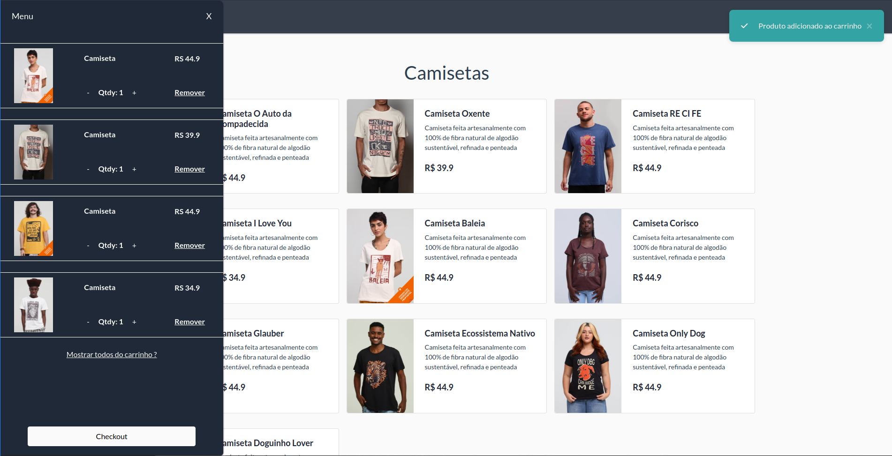
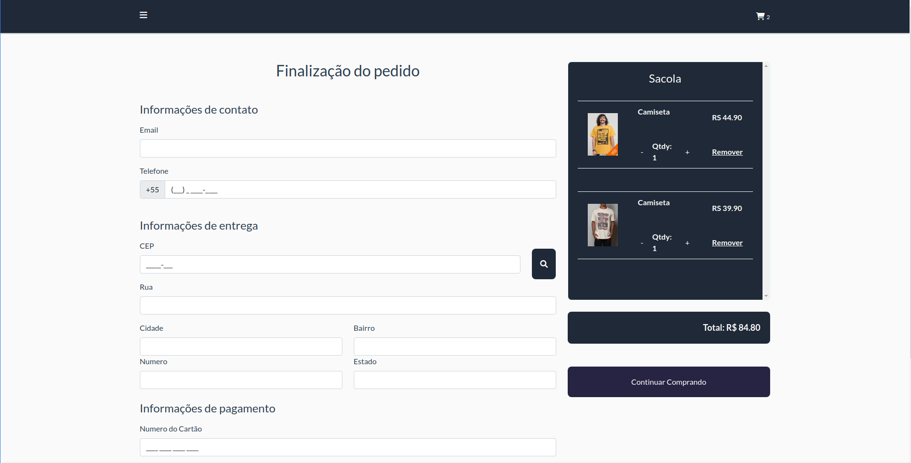

 <h1 align="center">Shop Vue.js</h1>





---

## Technologies

This project was developed with following technologies:

- [Vuejs 3](https://vuejs.org/)
- [Vue Router](https://router.vuejs.org/)
- [Pinia](https://pinia.vuejs.org/)
- [Vue Toastification](https://github.com/Maronato/vue-toastification#using-custom-icons)
- [Sass](https://sass-lang.com/)
- [Bootstrap](https://getbootstrap.com/)
  
---

## How to run

Clone this repo, and run command:

```Bash
yarn install
```

or

```Bash
npm install
```

> Require to install all dependencies

If you are not familiar with [Typescript](https://www.typescriptlang.org/pt/), take a look at the documentation

---

### You must run json-server to create a local server

```Bash
yarn dev
```

if it doesn't work, try:

```Bash
yarn run json-server src/data/source.json
```

---

### After that, run the command

```Bash
yarn start
```

or

```Bash
npm start
```

Open **localhost:3000** to view it in the browser.

---

Made by Rafael Butler
